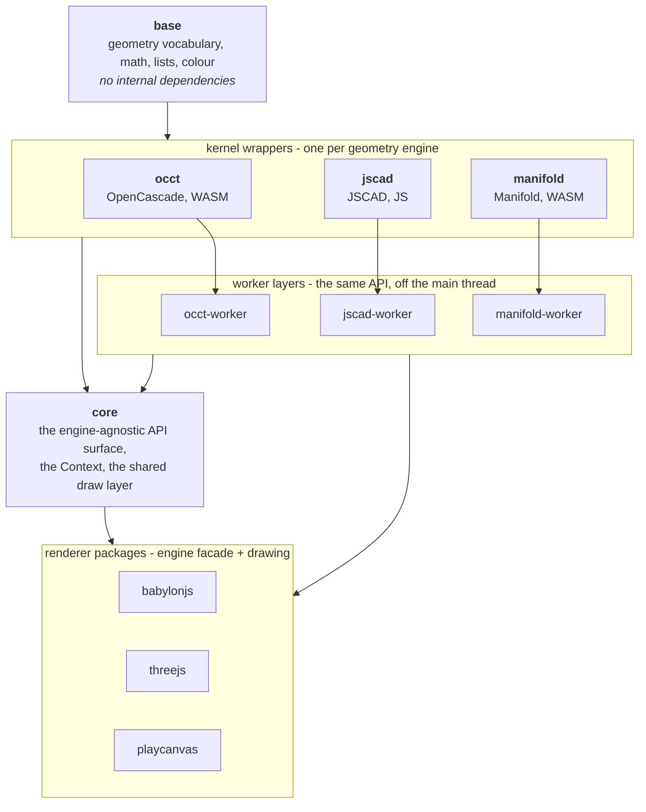
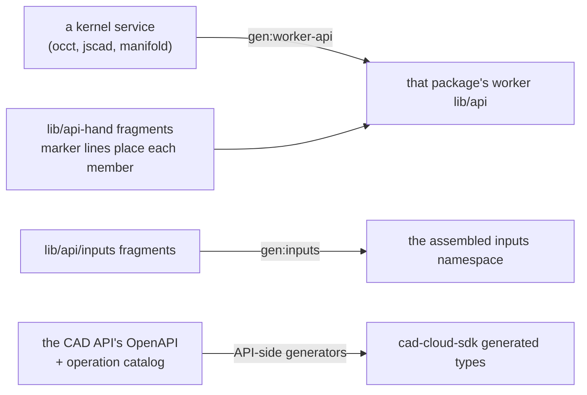

# Architecture

What these packages are, how they fit together, and which of those arrangements are load-bearing.

This page is the shape. It deliberately holds no technical detail: the conventions, kernel quirks and
accepted limitations live in the per-package `CLAUDE.md` files, listed at the bottom.

## What this repository is

Thirteen packages in one pnpm workspace, published to npm as `@bitbybit-dev/*` at a single lockstep
version. Together they are a CAD programming layer for the browser and for Node: geometry kernels
compiled to WebAssembly, wrapped in a typed API, moved off the main thread, and drawn by whichever 3D
engine the consumer already uses.

One property of that API explains much of what follows: **it is consumed as data, not only as code.**
The declarations and the JSDoc on them are machine-read - to generate bindings, to build
documentation, and by tools that store an API path as a stable identifier. The type surface is
therefore a public interface in a stronger sense than usual. Renaming a method or narrowing an input
is not only a source-compatibility question: it can invalidate data that was written against the old
name and that this repository will never see.

> **On the visual editors.** The reference consumer of that property is the visual editor on
> bitbybit.dev, which generates its node catalogue from these declarations and stores the dotted API
> paths inside users' saved scripts. **It is closed-source and is not part of this repository** -
> there is no editor and no node generator to find here. It is named only because it makes the
> constraint concrete. The design does not depend on it: a stable, machine-readable published surface
> is worth the same to anyone generating bindings, documentation or stored references from it, and
> nothing below should be read as existing to serve one downstream product.

## The layer model

Beside that stack sit two packages that depend on none of it: **cad-cloud-sdk**, a typed client for
the hosted CAD API, and **create-app**, the CLI that scaffolds a starter project.

| Layer | Holds | Depends on |
|---|---|---|
| `base` | the shared vocabulary every other package speaks: points, vectors, transforms, colour, lists, math | nothing |
| kernel wrappers | one package per geometry engine, each turning that kernel's own idiom into the shared vocabulary | `base` |
| worker layers | the same API again, dispatched across `postMessage`, with the kernel and its cache living in the worker | its own kernel |
| `core` | the engine-agnostic API surface, the `Context`, and the drawing logic that is not engine-specific | `base`, all three kernels, all three workers |
| renderer packages | the engine facade and the draw layer that goes through it - and nothing else | `core`, `base`, the three workers |

**The renderers are thin on purpose.** Everything that is not engine-specific is built once by
`createSharedServices` in `core`, so the three packages expose the same API rather than three that
have drifted. A service added directly to one renderer's `BitByBitBase` silently gives it to one
package only.

**A kernel wrapper never knows about a renderer, and a renderer never talks to a kernel directly** -
it goes through the worker layer. The one asymmetry is that `core` depends on both the kernels and
their workers, because it must be usable either way: in-process on Node, or across workers in a
browser.

## Why the worker split, and what it costs

WASM geometry kernels are slow enough to freeze a UI and large enough to be worth loading once. So the
kernel runs in a worker, and the main thread holds no geometry at all.

That has one consequence which shapes every worker API: **a kernel object cannot cross `postMessage`**.
It is a pointer into WASM memory, meaningless on the other side. So a worker never returns geometry -
it returns a **hash**, a handle into a cache that lives beside the kernel, and the next call sends the
hash back to be resolved. That cache is also the memoisation layer any interactive caller depends on,
since an expensive shape asked for twice is computed once.

The price is paid in three places, and all three are easy to reintroduce by accident: the cache must
be walked and bounded or WASM memory grows without limit; every result that nests a shape must be
hashed or the shape never arrives; and disposal has to be best-effort, because a freed handle throws
on contact rather than reading as null. `packages/dev/CLAUDE.md` carries the working detail.

## What is generated, and from what

A large fraction of this repository is written by generators. The rule is the same everywhere: **the
generated artifact is never the place to make a change.**

| Generated | By | Change it here instead |
|---|---|---|
| each worker package's `lib/api/**` | `npm run gen:worker-api` | the kernel service, or the `lib/api-hand/**` fragment |
| the assembled inputs namespaces | `npm run gen:inputs` | the fragments under `lib/api/inputs/` |
| `cad-cloud-sdk` generated types and request schemas | the API's own generators, writing across the repository boundary | the API's OpenAPI document or operation catalog |

`npm run check:worker-api` compares the worker API byte for byte against generator output, so a hand
edit there fails before it can confuse anyone. The inputs fragments and the worker fragments both use
**comments as structure**: a fragment member's marker line (`// replaces <path>`, `// after <path>`,
`// first`, `// last`) is what places it in the generated class, and the run of `//` lines opening an
inputs fragment is the header the assembler strips. Neither is commentary, and the lint rule that
bans free-form comments stays out of both trees.

The JSDoc on the public API is not in that table, because nothing here generates it - it is generated
*from*. Its tags (`@default`, `@optional`, `@step` and the rest, thousands of them) are structured
metadata that downstream generators read, so it is closer to a declaration than to prose. That is why
it is exempt from the comment ban, and why no tool in this repository may rewrite it: a fixer that
tidied it would silently change what those generators produce.

## The published contract

Three things leave this repository and cannot be taken back:

1. **The npm packages** - immutable once published, at a version shared by all thirteen.
2. **The declarations** - the type surface, and the JSDoc metadata on it, that downstream tools
   generate from.
3. **The dotted API paths** - which downstream tools store as stable identifiers, in data this
   repository never sees and cannot migrate.

The third is why some code here cannot be "corrected" on a whim. An input type that is the union of
three unrelated shape kinds, an API that tolerates values its types say cannot occur: narrowing or
widening either changes what an already-stored reference resolves to.

The practical rule: **internals are free, the surface is not.** Refactor freely behind the API;
changing what the declarations say is a release decision, not a code-review one.

A signature that returns a scene object where it has nothing to draw used to be listed here as
another of those. It was not load-bearing, it was a lie, and being unable to distinguish the two is
what let it stand: the drawing entry points declared a mesh and returned a tag, an overlay or nothing
at all through a double cast, and every layer above paid for it with casts of its own. It has been
corrected - `drawAnyAsync` and `drawAny` now derive what they return from the entity they were
given - which is a release decision, taken as one, in the window a release candidate exists for. The distinction worth keeping is the one that paragraph blurred: a
persisted *dotted path* cannot move, and a *type* that never described what the code does was never
the contract.

## Building and checking

The build order is **derived, never written down**: each package's manifest declares its siblings,
`scripts/gen-ts-references.mjs` turns that into TypeScript project references, and `tsc -b` and
`pnpm -r` follow them. `npm run check:references` fails when the two disagree, so a dependency added
to a manifest cannot be forgotten in the build.

Typechecking runs twice over every package, deliberately. `tsconfig.json` is the editor and test view,
the loose project. `npm run typecheck:strict` compiles a generated strict overlay with the full flag
set. Anything derived from the loose project - including a lint rule's advice about an unnecessary
assertion - has to be checked against the strict one before it is believed.

`npm run lint` carries two local rules with no fixers, and `npm test` runs the generators' own checks
before the suites, so a stale generated tree fails the aggregate rather than the next person.

## Where the detail lives

Detail sits next to what it describes, in three places.

**Per-package `CLAUDE.md`** holds what is true of one package: the kernel quirks, the engine
differences, the memory rules. Every package under `packages/dev` has one, and
`packages/dev/CLAUDE.md` holds what is true of all of them - the worker boundary, the two rules about
untrusted input and caller-owned data, and what a package's tsconfig `paths` actually describe.

**JSDoc on the function** holds what is true of one function, including the things that cannot be
re-derived: the closed-form SVD behind transforming an elliptical arc, how a DXF bulge picks between
the short and long arc, the extrusion edge numbering the 3D wire fillet depends on. That reaches the
editor, which is where someone meets the function.

**The documentation site** (`docs/learn`) holds what a user of the published packages needs before
they hit it: the colour range, which way is up, what an SVG import supports, how DXF colours and
versions behave.
