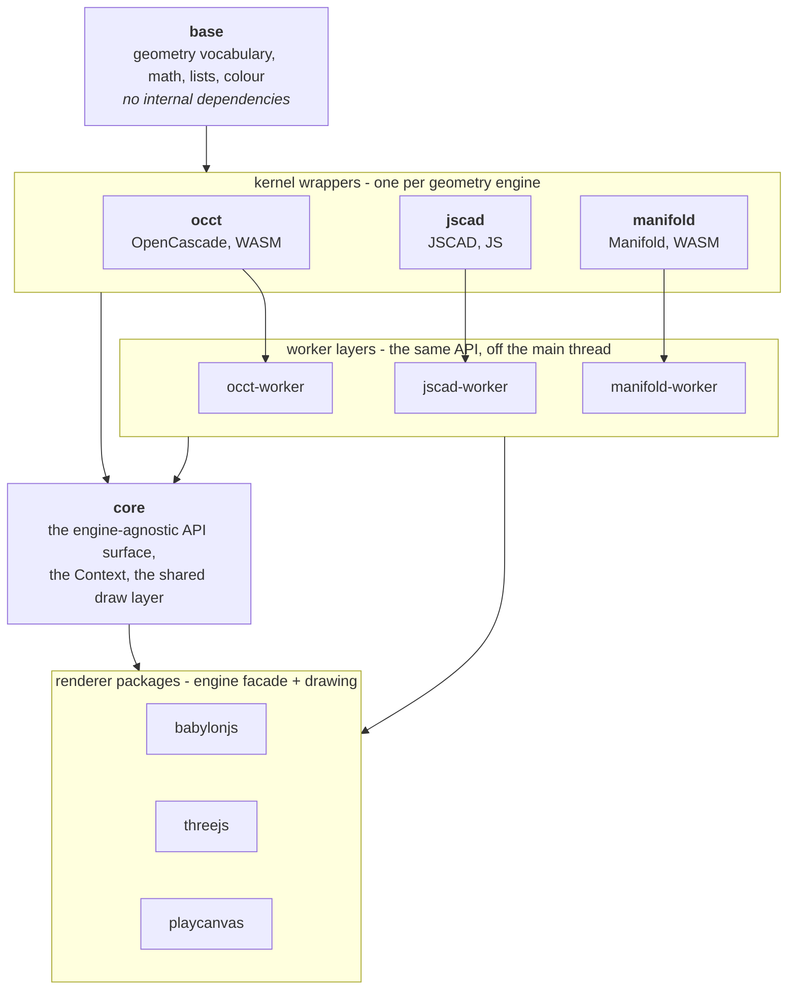
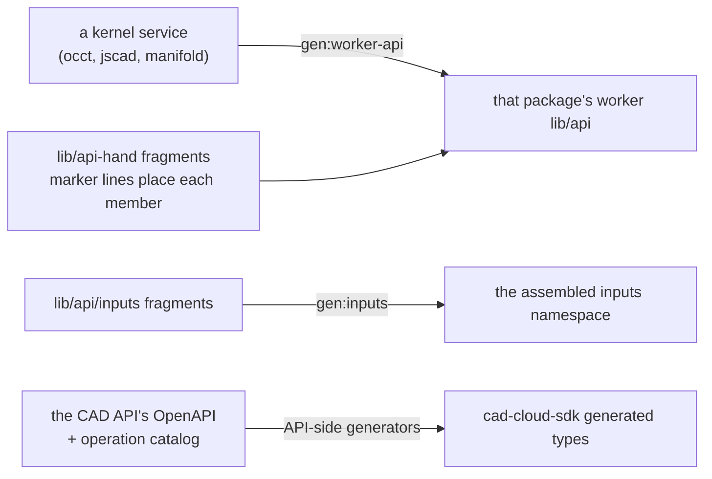

# Architecture

What these packages are, how they fit together, and which of those arrangements are load-bearing.

This page is the shape. It deliberately holds no technical detail: the conventions, kernel quirks and
accepted limitations live in the per-package `CLAUDE.md` files, listed at the bottom.

## What this repository is

Thirteen packages in one pnpm workspace, published to npm as `@bitbybit-dev/*` at a single lockstep
version. Together they are a CAD programming layer for the browser and for Node: geometry kernels
compiled to WebAssembly, wrapped in a typed API, moved off the main thread, and drawn by whichever 3D
engine the consumer already uses.

One property of that API explains much of what follows: **it is consumed as data, not only as code.**
The declarations and the JSDoc on them are machine-read - to generate bindings, to build
documentation, and by tools that store an API path as a stable identifier. The type surface is
therefore a public interface in a stronger sense than usual. Renaming a method or narrowing an input
is not only a source-compatibility question: it can invalidate data that was written against the old
name and that this repository will never see.

## The layer model

```mermaid
flowchart TD
    base["<b>base</b><br/>geometry vocabulary, math, lists, colour<br/><i>no internal dependencies</i>"]

    subgraph K["kernel wrappers - one per geometry engine"]
        occt["<b>occt</b><br/>OpenCascade, WASM"]
        jscad["<b>jscad</b><br/>JSCAD, JS"]
        manifold["<b>manifold</b><br/>Manifold, WASM"]
    end

    subgraph W["worker layers - the same API, off the main thread"]
        occtw["occt-worker"]
        jscadw["jscad-worker"]
        manifoldw["manifold-worker"]
    end

    core["<b>core</b><br/>the engine-agnostic API surface,<br/>the Context, the shared draw layer"]

    subgraph R["renderer packages - engine facade + drawing"]
        bjs["babylonjs"]
        three["threejs"]
        pc["playcanvas"]
    end

    base --> K
    occt --> occtw
    jscad --> jscadw
    manifold --> manifoldw
    K --> core
    W --> core
    core --> R
    W --> R
```

Beside that stack sit two packages that depend on none of it: **cad-cloud-sdk**, a typed client for
the hosted CAD API, and **create-app**, the CLI that scaffolds a starter project.

| Layer | Holds | Depends on |
|---|---|---|
| `base` | the shared vocabulary every other package speaks: points, vectors, transforms, colour, lists, math | nothing |
| kernel wrappers | one package per geometry engine, each turning that kernel's own idiom into the shared vocabulary | `base` |
| worker layers | the same API again, dispatched across `postMessage`, with the kernel and its cache living in the worker | its own kernel |
| `core` | the engine-agnostic API surface, the `Context`, and the drawing logic that is not engine-specific | `base`, all three kernels, all three workers |
| renderer packages | the engine facade and the draw layer that goes through it - and nothing else | `core`, `base`, the three workers |

**The renderers are thin on purpose.** Everything that is not engine-specific is built once by
`createSharedServices` in `core`, so the three packages expose the same API rather than three that
have drifted. A service added directly to one renderer's `BitByBitBase` silently gives it to one
package only.

**A kernel wrapper never knows about a renderer, and a renderer never talks to a kernel directly** -
it goes through the worker layer. The one asymmetry is that `core` depends on both the kernels and
their workers, because it must be usable either way: in-process on Node, or across workers in a
browser.

## Why the worker split, and what it costs

WASM geometry kernels are slow enough to freeze a UI and large enough to be worth loading once. So the
kernel runs in a worker, and the main thread holds no geometry at all.

That has one consequence which shapes every worker API: **a kernel object cannot cross `postMessage`**.
It is a pointer into WASM memory, meaningless on the other side. So a worker never returns geometry -
it returns a **hash**, a handle into a cache that lives beside the kernel, and the next call sends the
hash back to be resolved. That cache is also the memoisation layer any interactive caller depends on,
since an expensive shape asked for twice is computed once.

The price is paid in three places, and all three are easy to reintroduce by accident: the cache must
be walked and bounded or WASM memory grows without limit; every result that nests a shape must be
hashed or the shape never arrives; and disposal has to be best-effort, because a freed handle throws
on contact rather than reading as null. `packages/dev/CLAUDE.md` carries the working detail.

## What is generated, and from what

A large fraction of this repository is written by generators. The rule is the same everywhere: **the
generated artifact is never the place to make a change.**

```mermaid
flowchart LR
    kernel["a kernel service<br/>(occt, jscad, manifold)"] -->|gen:worker-api| workerapi["that package's worker lib/api"]
    hand["lib/api-hand fragments<br/>marker lines place each member"] --> workerapi
    frag["lib/api/inputs fragments"] -->|gen:inputs| ns["the assembled inputs namespace"]
    openapi["the CAD API's OpenAPI<br/>+ operation catalog"] -->|API-side generators| sdk["cad-cloud-sdk generated types"]
```

| Generated | By | Change it here instead |
|---|---|---|
| each worker package's `lib/api/**` | `npm run gen:worker-api` | the kernel service, or the `lib/api-hand/**` fragment |
| the assembled inputs namespaces | `npm run gen:inputs` | the fragments under `lib/api/inputs/` |
| `cad-cloud-sdk` generated types and request schemas | the API's own generators, writing across the repository boundary | the API's OpenAPI document or operation catalog |

`npm run check:worker-api` compares the worker API byte for byte against generator output, so a hand
edit there fails before it can confuse anyone. The inputs fragments and the worker fragments both use
**comments as structure**: a fragment member's marker line (`// replaces <path>`, `// after <path>`,
`// first`, `// last`) is what places it in the generated class, and the run of `//` lines opening an
inputs fragment is the header the assembler strips. Neither is commentary, and the lint rule that
bans free-form comments stays out of both trees.

The JSDoc on the public API is not in that table, because nothing here generates it - it is generated
*from*. Its tags (`@default`, `@optional`, `@step` and the rest, thousands of them) are structured
metadata that downstream generators read, so it is closer to a declaration than to prose. That is why
it is exempt from the comment ban, and why no tool in this repository may rewrite it: a fixer that
tidied it would silently change what those generators produce. `scripts/check-api-docs.mjs` only
reads it: it holds the corpus to `scripts/api-docs-baseline.json` against `API_DOCS_GUIDE.md`.

## The published contract

Three things leave this repository and cannot be taken back:

1. **The npm packages** - immutable once published, at a version shared by all thirteen.
2. **The declarations** - the type surface, and the JSDoc metadata on it, that downstream tools
   generate from.
3. **The dotted API paths** - which downstream tools store as stable identifiers, in data this
   repository never sees and cannot migrate.

The third is why some code here cannot be "corrected" on a whim. An input type that is the union of
three unrelated shape kinds, an API that tolerates values its types say cannot occur: narrowing or
widening either changes what an already-stored reference resolves to.

The practical rule: **internals are free, the surface is not.** Refactor freely behind the API;
changing what the declarations say is a release decision, not a code-review one.

A signature that returns a scene object where it has nothing to draw used to be listed here as
another of those. It was not load-bearing, it was a lie, and being unable to distinguish the two is
what let it stand: the drawing entry points declared a mesh and returned a tag, an overlay or nothing
at all through a double cast, and every layer above paid for it with casts of its own. It has been
corrected - `drawAnyAsync` and `drawAny` now derive what they return from the entity they were
given - which is a release decision, taken as one, in the window a release candidate exists for. The distinction worth keeping is the one that paragraph blurred: a
persisted *dotted path* cannot move, and a *type* that never described what the code does was never
the contract.

## Building and checking

The build order is **derived, never written down**: each package's manifest declares its siblings,
`scripts/gen-ts-references.mjs` turns that into TypeScript project references, and `tsc -b` and
`pnpm -r` follow them. `npm run check:references` fails when the two disagree, so a dependency added
to a manifest cannot be forgotten in the build.

Typechecking runs twice over every package, deliberately. `tsconfig.json` is the editor and test view,
the loose project. `npm run typecheck:strict` compiles a generated strict overlay with the full flag
set. Anything derived from the loose project - including a lint rule's advice about an unnecessary
assertion - has to be checked against the strict one before it is believed.

`npm run lint` carries two local rules with no fixers, and `npm test` runs the generators' own checks
before the suites, so a stale generated tree fails the aggregate rather than the next person.

## Where the detail lives

Detail sits next to what it describes, in three places.

**Per-package `CLAUDE.md`** holds what is true of one package: the kernel quirks, the engine
differences, the memory rules. Every package under `packages/dev` has one, and
`packages/dev/CLAUDE.md` holds what is true of all of them - the worker boundary, the two rules about
untrusted input and caller-owned data, and what a package's tsconfig `paths` actually describe.

**JSDoc on the function** holds what is true of one function, including the things that cannot be
re-derived: the closed-form SVD behind transforming an elliptical arc, how a DXF bulge picks between
the short and long arc, the extrusion edge numbering the 3D wire fillet depends on. That reaches the
editor, which is where someone meets the function.

**The documentation site** (`docs/learn`) holds what a user of the published packages needs before
they hit it: the colour range, which way is up, what an SVG import supports, how DXF colours and
versions behave.

## TypeScript configuration

Every TypeScript config in the packages is plain JSON - no comments, no trailing commas - and so is
every other tracked `.json` file outside `docs/` and `examples/`: `npm run check:json`
(`scripts/check-json.mjs`, a step of `npm test`) parses each with `JSON.parse` and lists the ones
that fail. A generated config therefore carries no banner, and the reasons behind each config live
here rather than in it.

**`tsconfig.base.cad.json`** holds the compiler options every published package shares, the whole
strict set included. Each package's configs extend it and keep only what differs there: `outDir`,
the paths into the sibling dists, the exclusions, and for the three Node packages their module
settings. The strict flags arrived one package at a time, held by a per-package baseline until each
reached zero; when the last package was through, they moved here from the leaves with a zero-change
proof - `tsc --showConfig` compared before and after for every config - so the packages compile
exactly as they did. Any change to the configs is proven the same way. `include`, `exclude` and
`files` are replaced by a leaf rather than merged, and relative paths resolve against the file that
defines them, so those stay in the leaves. The base is self-contained on purpose: the repository must
build from a bare clone with nothing above it. Its `lib` adds `es2022.error` alone rather than all of
es2022: that is what types `new Error(message, { cause })`, and a rethrow that drops the kernel's
original error is what makes a CAD failure hard to diagnose. The target stays es2015, so nothing about
the emit changes.

**The Node packages** - `cad-cloud-sdk`, `mcp` (a stdio MCP server and the library it is built from)
and `create-app` - write their configs by hand. Each `tsconfig.json` extends the base, so the strict
set applies there too, and states what differs: they are Node code rather than browser bundles, so
they compile as NodeNext at ES2022 (`create-app` with no DOM library), and they ship source maps and
declaration maps because their consumers step into them. That `tsconfig.json` is the editor and test
view, the specs included, which is what `typecheck:tests` and the type-aware lint read; the
`tsconfig.build.json` beside it is what `tsc` emits from, and only there are the specs excluded - a
compiled spec has no business in a published package. In `create-app` the two were once one file, so
excluding the specs from the build also took them out of the only project that named them, and both
the gate and the lint were quietly checking the source alone. The scaffold templates are copied, not
compiled.

### gen-ts-references

`scripts/gen-ts-references.mjs` writes the TypeScript project references from the package manifests,
so the build order has one source: `packages/dev/*/package.json`. For every package with a
`tsconfig.bitbybit.json` it writes three configs, and one at the root:

- **`tsconfig.bitbybit.json`**, the build config: a composite project whose `references` are the
  `@bitbybit-dev/*` siblings its manifest declares (dependencies and peer dependencies).
  `references`, `composite` and `tsBuildInfoFile` are the generator's; every other key is the
  package's own, read back from the file and kept on regeneration. The build info is written into
  `dist/` on purpose: `tsc -b` trusts it over the outputs when it decides a project is up to date, so
  it has to disappear with the dist it describes, or a deleted dist would "rebuild" to nothing.
- **`tsconfig.strict.json`**, the typecheck-only view: the build config with nothing emitted.
  `npm run typecheck:strict` runs it and must print nothing. It repeats the build config's
  references, because references are not inherited through `extends`; without them the view would
  follow a sibling's declarations into the source of a package it never resolves through its own
  paths, and typecheck that too.
- **`tsconfig.json`**, the view an editor and a lint run resolve: the same base and the same sibling
  paths as the build config, minus its emit settings and its exclusions, so the tests and mocks are
  part of the project. It is derived from the build config, so the two cannot disagree about where a
  sibling resolves. `outDir` is stated because TypeScript excludes it by default, and a stale or
  misspelt one silently pulls the built dist back in as source.
- **`tsconfig.build.json`** at the root references every package's build config. `tsc -b` orders
  the builds from it, and `pnpm -r run build-p` orders the staging the same way, from the same
  manifests.

`npm run gen:references` writes them; `npm run check:references` writes nothing and exits 1 when any
of them differs from what the manifests say.

### gen-worker-api

`CLAUDE.md` ("The generated worker layer") describes the generated worker classes; this is what it
leaves out. A fragment member in `lib/api-hand/` is placed by its marker line: `// replaces <path>`
is emitted at that kernel method's slot instead of the generated method, `// after <path>` right after
that slot (a private helper, a reserved command), and `// first` or `// last` before or after every
generated member. A replacing member without JSDoc of its own receives the kernel method's, so the doc
still has one author, and the fragment's imports are merged into the generated file. Every directory
of generated classes gets a generated barrel exporting its files in sorted order, except a package's
own `lib/api` barrel, which is hand-written because it also exports the init class. The manager is
private to a class with methods, passed on by a pure container, and public where a consumer subclass
overrides it (`core`'s OCCT worker classes). A worker method may be renamed from the kernel's only
through the generator's `methodNames` map, since those names are persisted in users' scripts. A kernel
type that no pointer mapping covers is an error, and so are an override or a rename that names no
generated method. Each generated file opens with one `// GENERATED` line naming the kernel file, and
the fragment where one contributes.

### gen-dto-meta

`scripts/gen-dto-meta.mjs` writes two things from the kernel surfaces and the inputs DTOs.

**The operation registries** (`lib/api/dto-registry.ts` in `occt`, `jscad` and `manifold`). A kernel
method takes one inputs DTO, and a caller - an object literal from a script, a message that crossed
to a worker, a request to a server - rarely spells out every property of it. The registry lists every
public operation by the dotted path a caller names it with and the DTO class it takes, so one call
before the kernel runs (`resolveInputs` in the base package) lays the caller's properties over the
DTO's defaults; a property holding another DTO is listed as nested and gets that DTO's defaults the
same way. Each DTO also gets a constraint table that `validateInputs` checks: a number, a flag, text,
a hex color, a point or vector of two or three numbers, a list of any of them, a value of a string
enum or a union of string literals, and `opaque` - checked for presence only - for everything else. A
number's range comes from its JSDoc `@minimum` and `@maximum`, made exclusive by
`@exclusiveMinimum true` or `@exclusiveMaximum true`; an infinite bound is no bound. The surface is
walked from the kernel's root class exactly as a dotted path resolves at run time
(`scripts/lib/kernel-surface.mjs`, shared with gen-worker-api). A parameter typed
`Inputs.<Namespace>.<Class>`, with or without type arguments, names its DTO; a method with no
parameter is listed with none; any other parameter is an error.

**The `Resolved` mirrors** (`lib/api/resolved-inputs/index.ts` in every package with inputs): every DTO
as `resolveDto` leaves it, each property with a default present and never undefined. Code that reads
a DTO after resolving it is typed against the mirror; code that takes one from a caller is typed
against `Inputs`, where a defaulted property may be left out. A package's `Inputs` re-exports
namespaces of the packages below it, and its mirror re-exports their mirrors the same way: the
re-exports are read from the package's `inputs/index.ts`, so the two cannot drift, and the mirrors
are generated in dependency order. A DTO's parent is looked up in its own package's inputs and then
in those of the packages below it.

In both, a DTO's properties are taken in the order the API index lists them - a concrete parent's
first, an abstract parent's after the class's own, a redeclared property in its parent's place - and
a parent the inputs do not hold is an error, because its properties and their defaults would
otherwise be left out without a sign. Every list is sorted with a fixed `en-US` collation: a bare
`localeCompare` collates by the machine's locale, and under one that sorts `y` with `i` the generated
files would differ.
