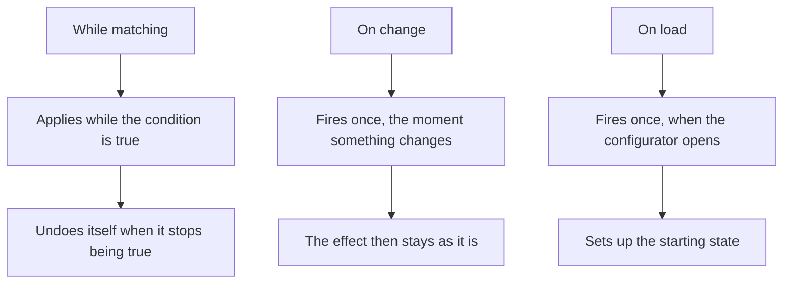

# Logic

Real products have dependencies. The oak finish is not available on the large size. Choosing the glass door forces the frame to metal. Selecting engraving reveals a field for the text.

Logic is where you write those down, so your shopper cannot build something you would have to refuse.

## Rules

A rule has a condition and one or more effects. When the condition is true, the effects apply.

Conditions use the same editor as everything else in Composer, so you already know it from variants: a simple pairing for one thing, or nested groups when several conditions combine.

## When a rule fires

Three choices, and picking the right one matters.

**While matching** keeps the effect applied for as long as the condition is true, and undoes it when it stops being true. This is what you want for showing, hiding and restricting things. An option that should be unavailable on large sizes should use this, so it comes back when the shopper picks a smaller size.

**On change** fires once, at the moment something changes. Use it for actions that should happen and then be left alone, such as resetting a dependent choice when the shopper switches material. You can name the specific controls that should trigger it.

**On load** fires once when the configurator opens, for setting up an initial state.

The distinction that catches people out is between while-matching and on-change. If an effect keeps reapplying when the shopper tries to change something, it probably wants to be an edge trigger. If an effect sticks around after it should have stopped, it probably wants to be while-matching.

## What a rule can do

**Set a control's value**, or **reset it to its default**. Use this to keep the configuration coherent when a choice invalidates another.

**Show or enable a control**, and the same for an individual option. This is the most common effect: hiding what does not apply and greying out what cannot be chosen. Disabling is often kinder than hiding, because the shopper can see the option exists and understands why it is unavailable.

Disabling cascades: greying out a section greys out everything inside it, however deeply nested. It also has a pricing consequence worth knowing - a choice the shopper cannot reach is never charged for, because billing someone for a choice they could not make would be wrong.

**Show a message**, so the shopper knows why. A rule that silently removes a choice is confusing, while one that says "oak is not available above 200 cm" is helpful.

**Override the minimum, maximum or step** of a number or slider, so the available range narrows to what you can actually make in the chosen material.

**Show or hide a 3D element**, whether a model, a part, a marker, a dimension, a decal or a light.

**Force a material variant** or **a colour or texture variant**, which is how one choice can drive an appearance change somewhere else.

**Run a script**, on the plans that include scripting.

Not every effect works with every trigger, and Composer tells you inline when a combination does not make sense rather than letting you publish something broken.

## The Overview

Alongside Rules there is an **Overview**, which shows every condition in the whole configuration in one place. Not just rules, but the conditions on variants, on options, on markers, on everything.

The rows are clickable. Clicking a rule takes you to that rule in the Rules list. Clicking any other row whose condition can be edited from here opens it in a small condition editor, so you can correct it without first working out which panel it lives in. The rows that cannot be edited in place say so instead, naming the section that owns them - *Edit in the Models section*, *Edit in the GUI section*, *Edit in the glTF structure section*, *Edit in the Bindings section*.

This is the page to open when a configurator misbehaves and you cannot see why. It shows what is conditional and, during Play, which conditions are currently true.

## Rules and option conditions together

You can put a condition directly on a control or an option, and you can write a rule that affects the same thing. Both are valid, and they serve different purposes.

Use a direct condition when the dependency is simple and belongs to that one option. Use a rule when the same condition drives several effects, or when the logic is complex enough that you want it written down in one readable place rather than scattered across twenty options.

When both apply to the same thing, the rule is the stronger statement - with one exception, which is worth stating precisely because it is a safety guarantee.

**For anything that carries money, a rule can take an option away but it can never grant one that the option's own condition denies.** An option carries money when it has a price of its own or links a product in your catalogue, and a control counts as carrying money when any of its options do. Hiding and greying out always work. Force-showing or force-enabling one of these is ignored, and the option's own condition decides - because the price a shopper is charged is worked out from that condition, so a rule that overrode it would hand the option over without charging for it. Publishing does not let the contradiction ship either: a rule that force-shows or force-enables a priced option or control which also carries a condition of its own is [refused at publish](/learn/3d-bits/composer/publish-blockers).

**For an option with no price and no linked product, a rule does override the option's own condition.** Nothing is charged either way, so a rule that shows a free option shows it. Do not rely on a rule as a restriction on something free: if a free choice must never be reachable, put the condition on the option itself.

## Keep it as simple as the product allows

Logic is the part of a configurator that grows without anyone deciding it should. Every rule interacts with every other rule, and a configurator with forty of them is genuinely hard to reason about.

Before adding a rule, check whether a condition directly on the option would do. Give rules names that say what they are for. And use the Overview periodically to see what you have accumulated.
