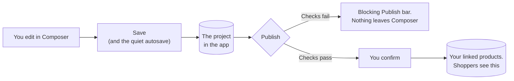

# Saving and Publishing

Composer can put your work in three different places, and they are not interchangeable. Knowing which is which prevents the two most common confusions: work that seems lost, and changes that unexpectedly went live.

## Save

**Save** stores your work in the project, in the app. Nothing reaches your storefront.

Composer also saves on its own. About a second and a half after you stop changing something, it sends the current state to the project quietly, without a message and without you pressing anything. It is the one thing Composer does without announcing it, precisely because you did not ask for it - so when it cannot run, it tells you differently: a broken-sync icon appears next to **Save**, and hovering it says why, usually *"Not autosaved - 2 form problems."*

Pressing Save yourself is still a good habit before you walk away, and unlike the background save it will tell you outright if it cannot record your changes.

Save as often as you like. This is the equivalent of saving a document.

## Publish

**Publish** sends the configurator to the products the project is linked to. This is the moment your changes become visible to shoppers.

It is a separate button from Save on purpose. You can spend a week reworking a configurator, saving throughout, while the version your shoppers see stays exactly as it was. Nothing goes live until you decide it does.

Pressing Publish does three things in order. It checks the configuration first, and if anything is wrong the request never leaves Composer - the problems appear in a **Blocking Publish** bar you can click through. Then it asks you to confirm, naming what is about to happen: *"Publish to your linked products? This updates what shoppers see on the storefront."* Only then does it save the project and publish it, so a publish always leaves your saved work and your live work in step.

Before publishing, press **Play** and go through the configuration as a shopper would. It takes a minute and catches almost everything.

## Files

**Files** is a label in front of four buttons on the bottom bar, not a menu. They are for moving a configuration out of the app or into it.

**Download scene config** gives you the configuration alone, which is the part that describes your product.

**Download project file** gives you that plus your editor state, meaning your camera position, what you had hidden while working, and similar. This is the one to use for a backup or for handing work to a colleague, since it restores the editor exactly as you left it.

**Copy to clipboard** is the same configuration as text, and **Import** loads either kind back in.

Use these for backups outside the app, for moving a configuration between stores, or for sending us something when you need help. They have nothing to do with publishing.

### The GLTF Export Options dialog

If any of your models has a parsed glTF structure with variants attached to it, downloading or copying the configuration first asks how much of that structure to include.

**Export Variants Only** is the recommended answer. It keeps the nodes that actually carry a variant configuration and drops the rest of the tree, which is usually most of the file.

**Export Full Structure** keeps the whole parsed tree. Choose it if you are going to add more variants to this copy later, since re-parsing a model can remove variant configurations you have already set up. The resulting file is much larger.

**Cancel** abandons the download rather than giving you a trimmed file by default.

:::warning Variants Only keeps variants, not every setting
"Variants" here means a node's show-and-hide condition. A node whose only configuration is a position, rotation or scale - a base transform, or transform variants, with no condition of its own - is not treated as a variant node and is dropped along with the rest of the tree.

If your models are configured that way, take **Download project file** for your backup, or choose **Export Full Structure**.
:::

## Configuration size

This dialog appears on download and copy only. **Publish sends the whole configuration, including the entire parsed glTF structure**, whether or not the nodes in it are used by anything. Parsing a model is not a one-off editor convenience - the structure is stored in the configuration and it ships.

That matters for two reasons. It is what your shoppers download on the product page, and it is the thing that makes a project too large to publish at all: past roughly 12 MB, publishing is refused with *"This project is too large to publish. Reduce the scene or split it into linked scripts."*

If a project is heading that way, re-parse the models you are actually using variants on and remove the parsed structure from the ones you are not.

## Which do I want?

Working on it, want to come back later: **Save**.

Happy with it, want shoppers to see it: **Publish**.

Want a copy outside the app, or to send it to someone: **Files**.

## Publishing to more than one product

A project can be linked to several products, and publishing updates all of them at once. That is how one configurator serves a whole range that shares a design.

You link products on the project's page in the app rather than in Composer. If you publish from Composer with nothing linked yet, Shopify's product picker opens so you can choose there and then.

## Versions, and getting an earlier one back

Every publish records a version on the project's page in the app, and you can take one yourself at any time with **Create backup**. History keeps the newest **20 published versions and 20 backups**; older entries drop off as new ones are created, and the page tells you when either list is full.

Any version can be **downloaded**, which is what you want for your records or for sending to support.

**Restore** is offered on backups, and it is the reason to take one before a risky change.

:::warning Restoring does not put a version back on the storefront
**Restore** writes the backup into your current **draft**, replacing whatever unsaved work is there. Your storefront carries on showing the version you last published until you publish again.

Rolling back is therefore two steps, not one: restore the backup, open it in Composer and check it in **Play**, then press **Publish**. If you need the configurator off the product page immediately while you sort it out, use **Unpublish** on the project's page instead - that stops linked products showing it at once.
:::

## If publishing is refused

Publishing can be blocked, and this is deliberate. Shipping a configurator that undercharges you, or that a shopper cannot add to the cart, is worse than an error message.

The message always says what needs fixing and it is specific - it names the option, the part, the control or the product, and where a figure is involved it names the figure. Pricing is only one of the reasons. The others are about your layout, a linked script, a PDF document, the size of the project, or the product the project is attached to.

[Publish blockers](./publish-blockers) lists every refusal with its fix. For the pricing ones in particular, [Pricing troubleshooting](/learn/3d-bits/pricing/troubleshooting) has more context.

Many of these checks also run while you work, in the **Setup problems** bar on the bottom bar, so you can clear them before you ever press Publish. The ones that have to read your Shopify catalogue can only run at the moment you publish.

## If nothing appears to happen

If Save or Publish seems to do nothing, look for a form error in the editor. Composer will not assemble a configuration containing an invalid field, so everything downstream stops - and each action tells you so when you press it. The **Needs attention** bar over the 3D view counts the offending fields and takes you to them. See [Troubleshooting](/learn/3d-bits/composer/troubleshooting).
