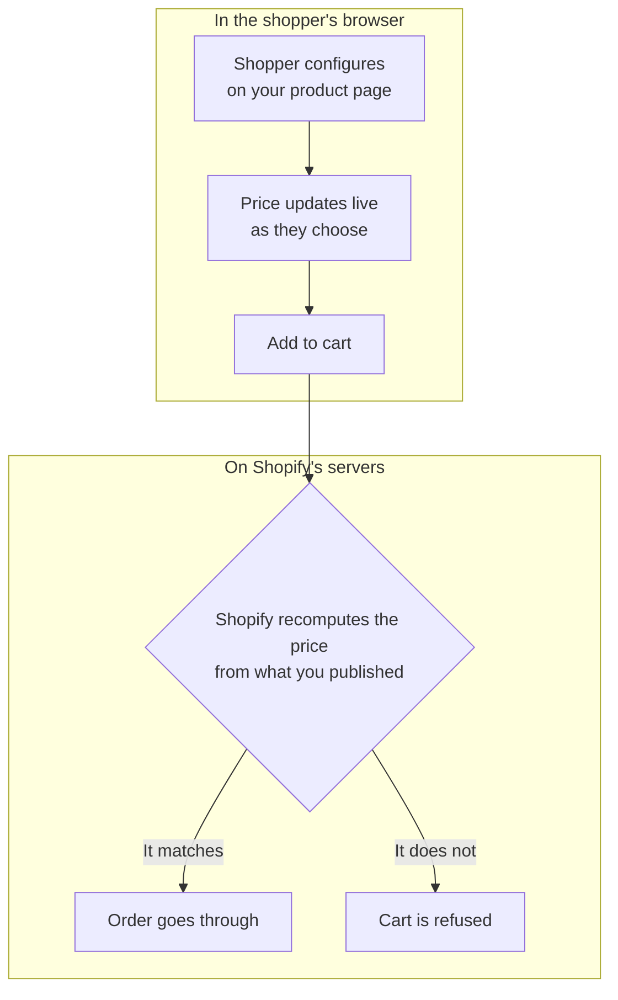

# How 3D Bits Works

You do not need to read this page to use 3D Bits. It is here for when you want to understand what is actually happening on your product page, either because you are choosing between two ways of setting things up or because something is not behaving as you expect.

## The pieces

There are three places where your configurator lives.

The **app**, inside your Shopify admin, is where you manage projects, upload assets, link products, publish, and review configured orders.

**Composer** is the editor you open from the app. Everything about a configurator is designed here: the 3D scene, the panel of options your shopper uses, the rules between those options, and the prices.

Your **product page** is where it all ends up. When you publish a project, the configuration travels to the products you linked it to, and the app embed puts the configurator on the page.

Checkout stays entirely with Shopify. When a shopper buys a configured product, the price is confirmed against what you published before the order can go through, and Shopify collects the money. We never process or hold payments.

That confirmation runs on Shopify's own servers rather than in the shopper's browser, which matters: the price a shopper is charged does not depend on anything their device could be persuaded to say. A cart that does not add up is refused rather than sold.



The split in that diagram is the whole idea. Everything above the line is convenience - it shows the shopper what they are building and what it will cost. Nothing above the line is trusted. The figure that gets charged is worked out again on Shopify's side, from the configuration you published, and it is that second calculation the order is held to.

## Two ways to drive a configurator

This is the choice that matters most, and it decides how much the rest of this page applies to you.

### Your own option panel, built in Composer

You build the controls in Composer, and 3D Bits renders them on the product page. The dropdowns, sliders and swatches are ours, so we know exactly what the shopper picked and there is nothing to interpret.

This is the recommended route and the one we would suggest for almost every new configurator. Your options are not limited by what Shopify variants can express, pricing formulas work, personalisation works, and nothing breaks when you change your theme.

### Your theme's own variant pickers

Alternatively, you let Shopify variants drive the model. The shopper uses your theme's own colour and size selectors, and 3D Bits watches those selectors and updates the 3D scene to match.

This is a good fit when your product is already well described by variants and you simply want a 3D view that keeps up. It is also how you would run 3D Bits alongside a product options app you already use.

The rest of this page is about this second route, because reading someone else's form is where the practical considerations live.

## How reading the page works

3D Bits watches the form fields on your product page. When a value changes, it takes the field's name and its new value and passes them to your configuration, which decides what to show.

Say your theme renders a size picker like this:

```html
<fieldset>
  <legend>Table Top Size</legend>
  <label>
    <input type="radio" name="size" value="small" />
    Small (100cm)
  </label>
  <label>
    <input type="radio" name="size" value="large" checked />
    Large (150cm)
  </label>
</fieldset>
```

In Composer you would say that one part of your model shows when `size` is `small`, and another when `size` is `large`. Click the option, the scene swaps.

Two details trip people up. The first is that we use the `name` and `value` attributes, not the words the shopper reads. In the example above the label says "Small (100cm)" but the value is `small`, and `small` is what you configure against. This is deliberate. Technical values survive being translated into another language and being reworded for a campaign, whereas the visible label does not.

The second is that some themes add a changing number to the field name, so `options[Color]` becomes `options[Color]-8329` and the number differs on every page load. Composer handles this with the `{{id}}` placeholder, so you configure `options[Color]-{{id}}` and it matches whatever the number happens to be. This is covered in [Dynamic IDs in Input Names](/learn/3d-bits/tutorials/getting-started/common-settings#dynamic-ids-in-input-names). If you are driving the scene from a script instead, the full field name including the number is passed to your script and you handle it yourself.

:::warning A placeholder cannot decide money
The `{{id}}` placeholder resolves in the browser, and checkout resolves inputs by exact control key - so a placeholder in a condition that decides a price would mean the price shown and the price enforced could disagree.

Publishing therefore **refuses** a `{{id}}` placeholder in any condition that gates money: a priced control's own visibility or enablement condition and every one above it, a priced option's conditions, a pricing formula's condition, and a part's condition. Use the control's stable key there instead. Unpriced options are unaffected.
:::

### What your theme needs to provide

This approach works with any product form built from ordinary HTML form fields, which is nearly all of them. Shopify's own variant selectors qualify, as do the great majority of themes and options apps.

What does not work is an interface built only from styled `div` elements with JavaScript behind them and no real form fields underneath. There is nothing for us to read there. If you are considering an options app and this route matters to you, ask the developer whether their options are real form inputs, or install it on a test product and check.

[Debug Mode](/learn/3d-bits/tutorials/getting-started/common-settings#enable-debug-mode) shows you exactly which field names and values 3D Bits can see on a page. It is the fastest way to answer this question and the first thing to turn on when something is not updating.

## Keeping it working

If you build your option panel in Composer, you can skip this section. Your controls are ours and they do not change underneath you.

If you drive the scene from your theme's variants or from another app, then your configuration depends on field names that belong to someone else. Those names are usually stable, but a theme update, a theme switch, or an options app changing its markup can rename them, and your configurator would then stop responding.

This is worth ten minutes of care rather than worry. Before you update an options app or switch themes, try it on a draft product or in Shopify's theme preview first, and check the configurator still responds. [Theme and App Updates](/learn/3d-bits/tutorials/getting-started/common-settings#theme-and-app-updates) walks through this. If a name has changed, Composer lets you rename the references in your configuration in one place rather than rebuilding anything.

It is also worth checking your live configurators from time to time, the same way you would check that your checkout still works. If you run a larger store, automated browser tests against a few key product pages will catch this sort of thing before a shopper does.

## What stays with Shopify

Taxes, shipping rates, discount codes, payments, fraud checks and refunds are Shopify's, unchanged. Your existing variants keep working for everything you do not configure. Inventory and orders behave normally.

3D Bits decides what a configured product costs, and that price is confirmed at checkout as described above. Everything else about selling stays where it already is.

## Where to go next

[Quick Start](/learn/3d-bits/quick-start) gets your first configurator live. [Composer](/learn/3d-bits/composer) covers building one in detail. If you are wiring 3D Bits to a form your own team built, [Custom Forms](/learn/3d-bits/integrations/custom-forms) has the specifics.
