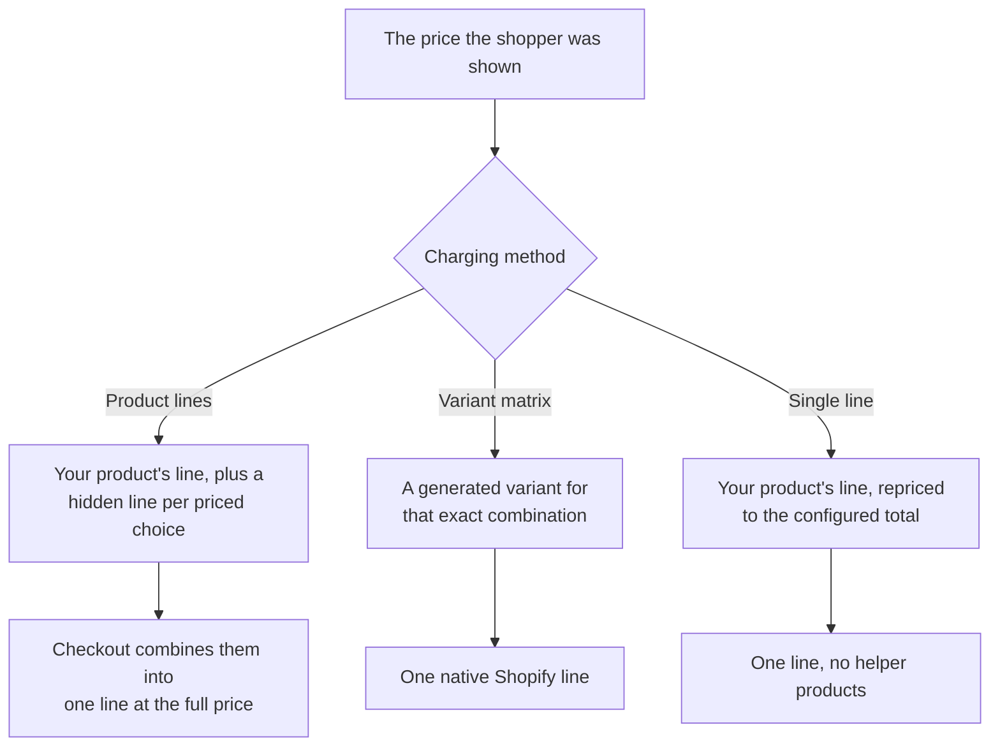

# Charging Methods

Shopify charges the price of real things in a cart. A configured price therefore has to become real cart contents somehow, and there are three ways to do that. You pick one per project, in **Storefront settings**.

If you are not sure, use **Product lines**. It works on every Shopify plan and handles every kind of pricing.

## Product lines

The configured price is assembled from real cart lines: your product, plus a hidden line for each priced choice.

**At checkout the shopper normally sees one line** at the full configured price - the extra lines are combined into it. The exception is a configuration that posts more than 2,000 units on one of those lines: Shopify will not combine a group that large, so the parts stay listed separately. Publishing warns you when a configuration of yours will do that.

In the **cart**, that combining has already happened too, but the combined row carries none of the
chosen options: Shopify keeps only 3D Bits' own bookkeeping on it. So the cart row would show a
price with nothing explaining it. 3D Bits fills that gap itself, adding a **configuration summary**
under the row - collapsed to a count, expanding to every choice with its swatch or thumbnail. The
full list is on the order either way.

- ✅ Works on **every Shopify plan**
- ✅ Handles everything: options, formulas, sliders, parts, linked products, quantity
- ✅ Every part appears on the order, so your team can see what to pick and make
- ⚠️ Creates hidden helper products in your catalogue ([what they are](./helper-products))

**Pick this if** you are starting out, you price with formulas or sliders, or the configuration is made of real products you also ship.

:::warning Your product's own price sets a floor
In this method the product's own Shopify price is posted on every configured order and is never rewritten, so no configuration can come to less than it. Publishing is refused if one could, and names the price the product should carry. See [Setting up pricing](./setting-up-pricing).
:::

### One line per option, or one combined charge

Product lines has a second setting, in the project's Storefront settings: **How option charges reach the order**.

**One line per chosen option** is the default. Each priced option gets its own hidden product, so the order itemises the options as separate lines - which is what you want when your workshop reads the order line by line.

**One combined charge** collects the priced options together instead, so a configuration adds one extra line however many options were chosen.

The trade-off is capacity. Checkout re-verifies every line a configuration posts, and refuses a cart it cannot finish verifying, so a configurator with many priced options lowers how many configured items one cart can hold. Publishing tells you the number. If shoppers are hitting that limit, switching to the combined charge is the fix.

Either way, options linked to your own products still ship as their own lines, and the order still carries the full breakdown of what was chosen.

## Variant matrix

3D Bits generates a real Shopify variant for every possible combination, on your own product. When a shopper configures, the storefront simply selects the matching variant.

- ✅ **Everything native**: Shopify's own pricing, Markets, discounts and inventory apply untouched
- ✅ Best choice when you sell internationally and want exact per-market prices
- ✅ No helper products
- ⚠️ Only possible when every priced choice is a **discrete option** - no formulas or sliders
- ⚠️ Takes over the product's variants entirely, replacing what is there
- ⚠️ Shopify caps variants per product, so very large combinations do not fit

**Pick this if** your options are all dropdowns, radios or checkboxes, the number of combinations is modest, and you want native Shopify behaviour everywhere - particularly across several markets.

:::warning It replaces your product's variants
Choosing this method rebuilds the product's option space. 3D Bits will refuse if the product has variants it did not generate, so your existing variants are never silently overwritten - but you should expect the product to be *about* the configurator once you switch.
:::

## Single line

The configured product is charged as one line whose price is set to the configured total.

- ✅ The cleanest cart: one line, no helper products at all
- ⚠️ Requires **Shopify Plus** (or a development store)
- ⚠️ Requires the **Standard or Pro** 3D Bits plan
- ⚠️ Overrides per-market price adjustments, so it suits single-currency stores better

**Pick this if** you are on Plus, sell in one currency, and want the tidiest possible cart.

:::note Which method to reach for first
Product lines and Variant matrix are the most thoroughly reconciled at checkout, because the amount
Shopify collects is made of real product lines it can check the configured total against. Single line
buys a tidier cart by charging one line instead, and is the right choice when that presentation
matters more to you. If you have no particular reason to prefer one, start with **Product lines**.
:::

## How many options each method supports

The limits differ sharply, and they are the main reason a method may not be available to you.

| | Product lines | Variant matrix | Single line |
|---|---|---|---|
| **Priced controls** | No fixed limit | **At most 3** | No fixed limit |
| **Options per control** | No fixed limit | Limited by the combination total | No fixed limit |
| **Total combinations** | Not enumerated - no limit | **At most 2,048** | Not enumerated - no limit |
| **Formulas and sliders** | ✅ | ❌ not possible | ✅ |
| **Parts** | ✅ | ❌ not possible | ⚠️ a *linked* part moves it to Product lines |
| **An option linking several products** | ✅ | ❌ not possible | ⚠️ moves it to Product lines |
| **A shopper-chosen quantity on an option** | ✅ | ❌ not possible | ✅ |
| **Quantity control** | ✅ | ❌ not possible | ✅ |
| **Multi-select checkboxes** | ✅ | ❌ not as a dimension | ✅ |

**Why the matrix is the strict one.** It generates a real Shopify variant for every combination, so it inherits Shopify's own product limits: **3 option dimensions** and **2,048 variants** per product. Four priced controls, or 3 controls whose options multiply past 2,048, cannot be expressed as variants at all.

Multiply your options to check: 8 woods × 5 sizes × 6 finishes = 240 combinations, comfortably inside. Add a fourth control and it becomes impossible regardless of the total.

**Why Product lines has no fixed limit.** It creates one hidden product per priced control and one variant per option, and splits a control across several products when it exceeds 250 options. So a control with 400 colours is fine.

There is still an overall ceiling: a configuration with a very large number of priced options and conditions can grow past what checkout will verify, and a cart checkout cannot verify is refused rather than waved through. Publishing tells you if you reach it, and names the size - see [Troubleshooting](./troubleshooting). In practice this is far beyond what a shopper would sensibly navigate.

**If the matrix is not possible**, publishing says exactly why and uses Product lines instead rather than failing. It checks these in order, and names the first one it meets:

1. A **set multiplier** control, which multiplies the whole configuration.
2. An option that lets the **shopper choose a quantity**.
3. A **priced control that cannot be a variant dimension** - only dropdowns, radio buttons and checkboxes can be.
4. An option that **links several products**, since they must reach the order as their own lines.
5. Any **part** - a linked one is a real item needing its own line, and a priced unlinked one is an amount rather than a variant.
6. Any **formula**, which produces amounts that cannot be enumerated.
7. A **multi-select** control, since a variant holds one value per option.
8. **No priced option controls at all** to build a matrix from.
9. More than **3 option dimensions**, which is Shopify's limit.
10. More than **2,048 combinations**, which is also Shopify's limit.

## Choosing

| Your situation | Method |
|---|---|
| Just getting started | Product lines |
| You price with a slider, a formula, or by area or length | Product lines |
| The configuration is made of parts you also ship | Product lines |
| One choice adds several of your own products | Product lines |
| All options are discrete, and you sell in several currencies | Variant matrix |
| You are on Plus, sell in one currency, want the tidiest cart | Single line |
| More than 3 priced controls, or more than 2,048 combinations | Product lines (the matrix cannot express it) |

## Changing your mind

You can switch methods and republish. 3D Bits cleans up after the method you left - archiving helper products it no longer needs, or restoring your product to a single variant when you leave the matrix.

Two things to know before you switch:

- **Archived, never deleted.** Past orders point at helper products, so they are archived rather than removed. Deleting them by hand breaks your order history.
- **After leaving the variant matrix**, check your product's price. The matrix replaced its original variants, so 3D Bits restores it to a single variant priced at your authored base price, or at the cheapest combination it had generated if there is no base price - which may not be the price you want.

If a method you picked is not available to your store or your configuration, publishing tells you and uses **Product lines** instead rather than failing.

Product lines is the fallback, so it has none of its own. When *it* cannot be provisioned either, publishing stops rather than going live with a configurator that would collect the wrong amount.
