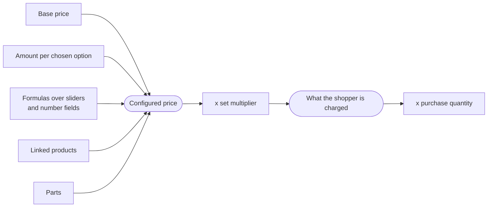

# Configurator Pricing for Shopify

Your shopper picks oak legs instead of pine, drags a width slider to 180 cm, and ticks "add a mounting kit". The 3D model updates as they go. **Configurator pricing** means the price updates too - and that the amount Shopify charges at checkout is the amount they were shown.

You author it once in Composer. There is no code, and no third-party pricing app required.

:::info Works with what you already have
Configurator pricing is built into 3D Bits, so most stores need nothing else. It is also **fully compatible** with how you price today: keep Shopify variants for what you already sell, keep a product-options app if it does something you need, and switch configurator pricing off for those products. Both approaches are supported, and you can mix them across your catalogue.
:::

## A worked example

Here is a made-to-order table. The merchant authored four things:

| What the merchant set up | Amount |
|---|---|
| Base price for the table | 400.00 |
| Legs option: **Oak** (Pine adds nothing) | + 90.00 |
| A formula over the width slider: `width * 2.5` | + 200.00 at 80 cm |
| Part: **Mounting kit**, included with every table | + 35.00 |

A shopper who picks oak and drags the width to 80 cm sees **725.00**, and pays 725.00 at checkout.

If they switch back to pine, the model changes, the total drops to 635.00, and checkout follows.

## What you can price

- **A base price** - where every configuration starts.
- **An amount per option** - "+90 for oak", "+15 for engraving". Works with dropdowns, radio buttons, checkboxes and switches.
- **How many of an option** - let the shopper choose a number of one option with a `+/-` stepper. Its amount then becomes a price per unit.
- **Your own products, linked to an option** - point an option at real products in your catalogue and it is charged at their price, and they appear on the order so your team knows to pick them. One option can carry up to ten of them, each with its own quantity. *Pro plan.*
- **Formulas** - an expression over a slider or number field, like `width * 2.5` or `round(area * 45)`. This is what makes continuous choices (size, length, area) priceable.
- **[Parts](/learn/3d-bits/composer/gui/parts)** - the things the configured product is made of. A part can be a real product you charge for and ship, or simply a line on the works order. *Pro plan.*
- **A set multiplier** - nominate one of your controls to multiply the whole configured price, which is how you price by area or by running metre. This is **not** the purchase quantity.
- **A purchase quantity** - a **Quantity** element you place in the panel, for a shopper buying several of the configuration they just built.

You can also have the configurator grey out choices it cannot currently sell, by checking the real products behind them when the page loads. See [Linked products](./linked-products#showing-what-cannot-be-bought-right-now).

## What the shopper sees

The price element updates live as they change options, and can show an itemised breakdown - base, each chosen option, each formula, each part - so nothing about the total is a mystery. You can also show a **parts list** of what the configuration is made of.

At checkout the configured product normally appears as a single line at the price they were shown. A configuration that posts more than 2,000 units on one of its lines is the exception: Shopify will not combine a group that large, so the shopper sees its parts listed separately, and publishing warns you when yours will. Their choices travel with the order, so your team can see exactly what to make.

## What stays with Shopify

Configurator pricing decides **what the product costs**. Everything around that stays where it already is:

- ✅ Taxes, shipping rates and discount codes - Shopify, exactly as for any other product
- ✅ Payment, fraud analysis and refunds - Shopify
- ✅ Your existing variants for anything you do not configure - Shopify
- ❌ 3D Bits never processes payments and never holds money

## Where to go next

1. **[Set up your first price](./setting-up-pricing)** - turn it on and price one option, start to finish.
2. **[Choose a charging method](./charging-methods)** - three ways to turn a configured price into a real Shopify charge, and how to pick.
3. **[Link your own products](./linked-products)** - charge through products you already sell.
4. **[Helper products](./helper-products)** - the hidden products 3D Bits creates, and the rules for living with them.
5. **[Test your prices first](./test-mode)** - see your numbers on a real product page before anything is created.
6. **[Go live](./going-live)** - what to test, and how to review configured orders.
