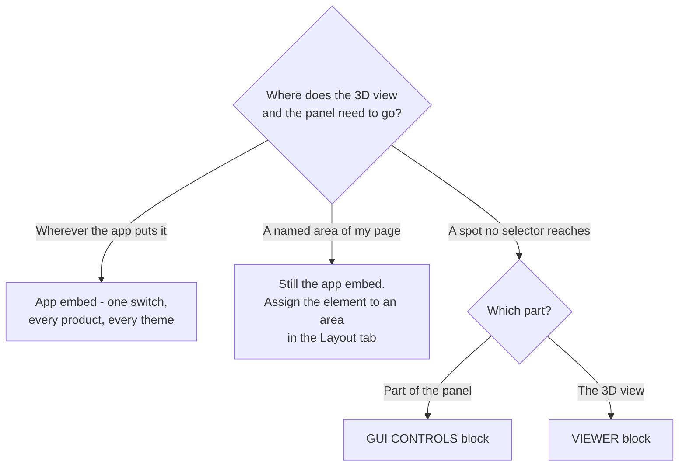

# Theme Blocks

Start here: **most stores do not need this section at all.**

The [app embed](/learn/3d-bits/quick-start/enable-app-embed) is one switch that puts your published configurators on your product pages automatically. It works on every theme, needs no per-product setup, and survives you publishing new products. That is the recommended route and it covers the large majority of stores.

Theme blocks are the alternative, for when you want to decide exactly where something goes in your template. You place them by hand, per template, in the Shopify theme editor.

## When placing blocks yourself is worth it

There are fewer reasons than you might expect, because spreading your option panel around the product page does not need a block.

Composer already places elements outside the main panel on its own. The four canvas corners and the canvas centre sit on top of the 3D view, the buy area sits next to your add to cart form, and a custom area anchors to a CSS selector of your theme, so a group of options can land beside the product title or anywhere else you can name. You assign an element to one of those areas in the **Layout** tab and publish, and the app embed does the rest. [Layout](/learn/3d-bits/composer/gui/layout) covers how that works.

Two things genuinely call for a block.

The first is hosting one of those areas somewhere a CSS selector cannot reach, or simply preferring to point at the spot in the theme editor rather than write a selector. That is what the [GUI Controls block](/learn/3d-bits/theme-blocks/bitbybit-gui) is for. It claims one area and hosts its contents wherever you drop it, instead of where 3D Bits would have drawn it.

The second is wanting the 3D view itself in a very specific place that the embed's placement setting cannot reach, and preferring to position it in the theme editor where you can see it. That is a [BITBYBIT VIEWER block](/learn/3d-bits/theme-blocks/bitbybit-viewer).

Canvas height, maximum width and which side the panel sits on are set per project in the app rather than in the theme editor. Be aware that those layout and sizing fields only apply while the app embed is doing the placing. A project switched over to blocks is positioned by where you put the blocks, and the app hides those fields for it.

One trade-off worth knowing before you commit. Blocks live in your theme, so if you change themes you place them again. The app embed is switched on once per theme and then forgotten.

## Switching a project to blocks

Placement is a per-project decision rather than a store-wide one. Open the project in the 3D Bits admin, go to **Storefront settings**, and set **Placement on the product page** to **Theme template blocks**. Save, then publish.

From that point the app embed stands down on every product linked to that project, which is what stops two viewers being drawn on the same page. Nothing takes its place until you have placed the blocks yourself.

:::warning A product template with no viewer block shows nothing
The switch is deliberately held back until your next publish, so a live page cannot go blank before you have had a chance to place the blocks. Once it is published, a product template without a BITBYBIT VIEWER block renders no 3D and no options at all.
:::

You need one BITBYBIT VIEWER block for the 3D view and the main panel, plus a GUI CONTROLS block for each area you want hosted somewhere particular. If you change your mind, set **Placement on the product page** back to **App embed** and publish again.

## The blocks

**[App embed](/learn/3d-bits/theme-blocks/app-embed)**, shown as *3D Bits - Auto 3D on product pages*, is not placed in a template at all. You switch it on once under App embeds and it handles every published product. This is the one to use.

**[BITBYBIT GUI CONTROLS](/learn/3d-bits/theme-blocks/bitbybit-gui)** hosts one area of your option panel wherever you drop it, overriding where that area would otherwise appear. Pairs with a 3D view elsewhere on the page.

**[BITBYBIT VIEWER](/learn/3d-bits/theme-blocks/bitbybit-viewer)** renders the 3D view for a product in a specific spot in your template, as an alternative to letting the embed place it.

**[BITBYBIT PREVIEW](/learn/3d-bits/theme-blocks/bitbybit-preview)** embeds a public project from [bitbybit.dev](https://bitbybit.dev). It shows a scene but does not respond to product options, so it suits a showcase rather than a configurator.

**[BITBYBIT RUNNER](/learn/3d-bits/theme-blocks/bitbybit-runner)** is legacy, and the theme editor labels it so. It runs an exported script directly in the template. If you are doing this today, build a Script in the app and link it into a Composer project instead, which gives you the option panel, pricing and publishing around it.

**[BITBYBIT APPS](/learn/3d-bits/theme-blocks/bitbybit-apps)** is a Pro plan block for development teams shipping an entire application of their own on the product page. Specialised, and rarely the right starting point.

## Working with Shopify templates

If you are going to place blocks, it helps to understand templates, because that is where blocks live.

Every product in your store uses a template, and new stores start with a default one. A template is a blueprint applied to many products at once, so editing it changes every product using it, which saves you repeating yourself. If only some of your products should show 3D, and you are placing blocks rather than using the embed, you would make a separate template for those.

To see which template a product uses, open the product in your Shopify admin and look for the **Theme Template** card at the bottom of the right sidebar. The eye icon opens it for editing.

To create a new one, open **View Template** for a product, click the template name at the top of the screen, and use the **Create template** button, choosing an existing template as the starting point.

Inside a template you will find blocks from Shopify itself, such as Variant Picker and Buy Buttons, alongside blocks from apps like ours.

Shopify's own [documentation on templates](https://help.shopify.com/en/manual/online-store/themes/theme-structure/templates) goes deeper if you need it.

## Settings reference

Several settings appear on more than one block and are documented once, in [Common Settings](/learn/3d-bits/tutorials/getting-started/common-settings). Each block's own settings have their own page, linked from the list above.
