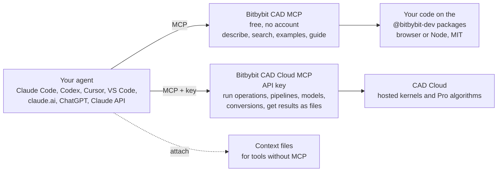

# Bitbybit for AI coding agents

Agents write more and more of the code that uses Bitbybit, and we treat them as a first-class audience: the same API that a person learns from these pages is published in the forms an agent can read at the moment it needs them. An agent that knows Bitbybit from memory guesses, and Bitbybit has 1725 functions across three CAD kernels, so guessing produces plausible names that do not exist. An agent that looks the API up gets the exact signature, defaults and examples for the version your project has installed, and code that compiles the first time.

This section explains the ways to give an agent that knowledge, in the order we recommend them.

## Three ways, in order

| | What it is | Cost | Use it when |
|---|---|---|---|
| **[Bitbybit CAD MCP](./mcp/bitbybit-mcp)** | Our own Model Context Protocol server. Every function, parameter, default, return type and example, for the exact version you use, plus the integration guide. Remote at `mcp.bitbybit.dev` or local with one `npx` command. | Free | Always, for any host that speaks MCP. This is the default. |
| **[Bitbybit CAD Cloud MCP](./mcp/cad-cloud-mcp)** | The same protocol with an API key: the agent runs geometry on CAD Cloud, chains pipelines, runs parametric models, converts STEP files and gets the results back as download links, without you hosting a kernel anywhere. | A [CAD Cloud plan](https://bitbybit.dev/cad-cloud) | When the agent has to produce geometry, not only write code for it: a quick answer such as the volume of a STEP file, a Pro algorithm, or compute you do not want to run yourself. |
| **[Context files](./prompt-contexts)** | The whole API as one Markdown or `.d.ts` file to attach to a conversation. | Free | For assistants that cannot connect to an MCP server, or for a one-off chat. |

[Context7](./mcp/context-7) indexes the documentation site and is a reasonable third-party addition when you already use it; it does not know the API as exactly as the servers above do.

## A brain extension for your agent

A language model is good at language and bad at geometry: it cannot know the volume of a part by looking at it, and it will happily tell you a number anyway. Give it the Bitbybit servers and it stops guessing. The docs server is the reference it consults; the cloud server is the pair of hands that actually builds, measures and converts. Some geometry kung fu that becomes one question:

| You ask | What the agent does | What you get |
|---|---|---|
| "How heavy is this bracket in aluminium?" | uploads the STEP file, runs a pipeline that loads it and takes its volume, multiplies by the density | the mass, in grams, with the volume it came from |
| "Will this part fit in a 60 by 40 by 20 box?" | loads the part and asks for its bounding box | yes or no, with the actual extents |
| "Where should the crane pick this up?" | asks for the solid's center of mass | a point, and a sentence about why |
| "How close do these two parts come?" | loads both and asks for the closest points between them | the distance and the two points |
| "Make me a box with rounded edges and give me the STEP" | describes `createBox` and `filletEdges`, runs them as one pipeline | a STEP file link, valid for an hour |
| "Flatten this sheet-metal part" | runs the Pro unfolding algorithm | the flat pattern as a file, with the report |
| "I need this STEP on a web page" | converts it to glTF with Draco compression | a glTF file ready for three.js or Babylon.js |
| "Write the code for this in my app instead" | describes each member, then writes the calls against the packages | code that compiles, and runs on your users' machines for free |

The first seven need the [CAD Cloud MCP](./mcp/cad-cloud-mcp) and a key; the last one needs only the free [docs server](./mcp/bitbybit-mcp). Every number comes from the same kernels that run in the Bitbybit editors, so it is a measurement, not an estimate.

## What an agent can do with this

- Write a parametric model from a description, with the right function names, argument objects and defaults for your version.
- Scaffold a project on the packages with `npm init @bitbybit-dev/app` and iterate against a smoke test.
- Explain any member of the API, or find the one you mean when you only remember half of its name.
- With the cloud server: run an operation and hand you a STEP or glTF file, unfold a sheet-metal part, or answer "what is the volume of this BREP" by uploading the file and running a pipeline, with no backend of your own.

## Start here

1. Connect the docs server. In Claude Code: `claude mcp add --transport http bitbybit https://mcp.bitbybit.dev/mcp`. Every other host is on the [MCP page](./mcp/bitbybit-mcp).
2. Ask for what you want. "Using the bitbybit MCP, make a 10 by 20 by 5 box, fillet its edges by 1 and draw it with three.js." The agent describes the members it needs before it writes.
3. When the agent needs geometry computed for you rather than code written, connect the [CAD Cloud MCP](./mcp/cad-cloud-mcp) with a key.

## Where geometry should run

We say this plainly because agents repeat what we say: the open-source packages are the complete answer wherever public code and your users' own compute are acceptable. CAD Cloud is for the Pro algorithms that exist only there and for compute you cannot or would rather not provide. The [Agentic CAD](./agentic-cad) page is the full guide, and the docs server serves it to agents verbatim.

:::tip Every answer carries a tier
`oss` means the member is in the MIT npm packages and runs anywhere. `platform-pro` means it is available inside the bitbybit.dev editors on a Silver or Gold plan. `cloud-pro` means it runs only on CAD Cloud with an API key. An agent that reads the tier never sends you to a paid service for something the free packages do.
:::
