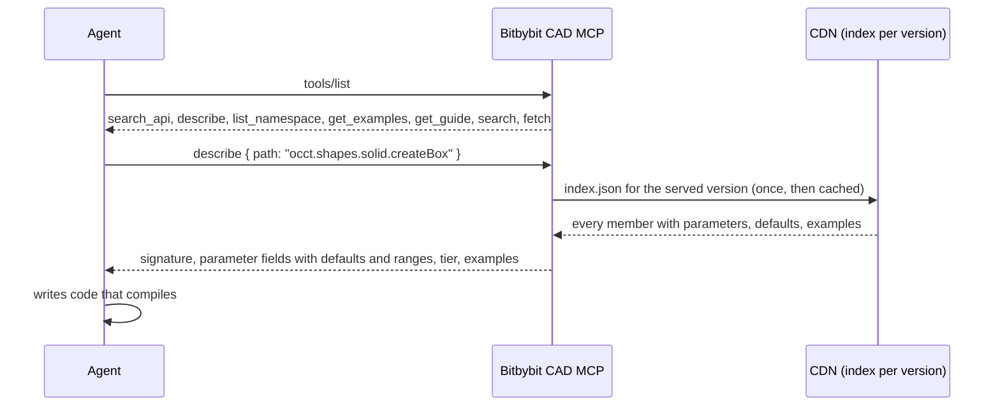

# Bitbybit CAD MCP

The Bitbybit CAD MCP server documents the whole API for AI coding agents: every function, its parameters, defaults, return type and examples, for the exact version your project has installed. An agent connected to it looks the API up instead of guessing it. It is free, needs no account, and answers only questions; it never runs geometry (that is the [CAD Cloud server](./cad-cloud-mcp)).

## Two forms, the same tools

| | Remote | Local |
|---|---|---|
| Address | `https://mcp.bitbybit.dev/mcp` | `npx -y @bitbybit-dev/mcp` |
| Transport | Streamable HTTP | stdio |
| Needs | nothing: no account, no key | Node 20 or newer |
| Version it serves | the newest release, or the `version` you name in a call | the version of the `@bitbybit-dev` packages installed in your project |
| Best for | claude.ai, ChatGPT, the Claude API, shared team configuration | a project checkout, offline work, an exact pin |

Both answer from the API index Bitbybit publishes with every release, addressed by exact version and never by a moving "latest", so an answer is exact for the version you name.



## Connect it

### Claude Code

```bash
claude mcp add --transport http bitbybit https://mcp.bitbybit.dev/mcp
```

or the local server:

```bash
claude mcp add --transport stdio bitbybit -- npx -y @bitbybit-dev/mcp
```

For a project, commit a `.mcp.json` at its root instead, so every collaborator's Claude Code finds it:

```json
{
    "mcpServers": {
        "bitbybit": { "type": "http", "url": "https://mcp.bitbybit.dev/mcp" }
    }
}
```

### Cursor

[Add to Cursor](cursor://anysphere.cursor-deeplink/mcp/install?name=bitbybit&config=eyJ1cmwiOiJodHRwczovL21jcC5iaXRieWJpdC5kZXYvbWNwIn0=) installs it with one click. Or create `.cursor/mcp.json` in the project (or `~/.cursor/mcp.json` for every project):

```json
{
    "mcpServers": {
        "bitbybit": { "url": "https://mcp.bitbybit.dev/mcp" }
    }
}
```

### VS Code

[Install in VS Code](vscode:mcp/install?%7B%22name%22%3A%22bitbybit%22%2C%22type%22%3A%22http%22%2C%22url%22%3A%22https%3A%2F%2Fmcp.bitbybit.dev%2Fmcp%22%7D) (or [in VS Code Insiders](vscode-insiders:mcp/install?%7B%22name%22%3A%22bitbybit%22%2C%22type%22%3A%22http%22%2C%22url%22%3A%22https%3A%2F%2Fmcp.bitbybit.dev%2Fmcp%22%7D)) adds it with one click. Or create `.vscode/mcp.json`; the `type` is required, or VS Code tries to start the URL as a program:

```json
{
    "servers": {
        "bitbybit": { "type": "http", "url": "https://mcp.bitbybit.dev/mcp" }
    }
}
```

MCP works in agent mode; check that `chat.mcp.enabled` is on.

### Codex

```bash
codex mcp add bitbybit --url https://mcp.bitbybit.dev/mcp
```

or the local server with `codex mcp add bitbybit -- npx -y @bitbybit-dev/mcp`. The same entry in `~/.codex/config.toml`:

```toml
[mcp_servers.bitbybit]
url = "https://mcp.bitbybit.dev/mcp"
```

### Gemini CLI

```bash
gemini mcp add -t http bitbybit https://mcp.bitbybit.dev/mcp
```

or in `~/.gemini/settings.json`, where `httpUrl` is the Streamable HTTP field (`url` would mean SSE):

```json
{
    "mcpServers": {
        "bitbybit": { "httpUrl": "https://mcp.bitbybit.dev/mcp" }
    }
}
```

### Windsurf

In `~/.codeium/windsurf/mcp_config.json` a remote server takes `serverUrl`:

```json
{
    "mcpServers": {
        "bitbybit": { "serverUrl": "https://mcp.bitbybit.dev/mcp" }
    }
}
```

### Zed

In Zed's `settings.json`:

```json
{
    "context_servers": {
        "bitbybit": { "url": "https://mcp.bitbybit.dev/mcp" }
    }
}
```

### JetBrains IDEs

Settings, Tools, AI Assistant, Model Context Protocol (MCP), add a server with this JSON configuration:

```json
{
    "mcpServers": {
        "bitbybit": { "url": "https://mcp.bitbybit.dev/mcp" }
    }
}
```

### claude.ai and Claude Desktop

Settings, Connectors, "Add custom connector": name `bitbybit`, URL `https://mcp.bitbybit.dev/mcp`, no sign-in.

### ChatGPT

Settings, Apps and Connectors, Advanced, enable Developer Mode, then add a connector with the URL `https://mcp.bitbybit.dev/mcp`. The server exposes the `search` and `fetch` tools ChatGPT's connectors require.

### The Claude API

A server-side agent built on the Claude API can use the server directly, without hosting anything:

```json
{
    "mcp_servers": [{ "type": "url", "url": "https://mcp.bitbybit.dev/mcp", "name": "bitbybit" }],
    "tools": [{ "type": "mcp_toolset", "mcp_server_name": "bitbybit" }]
}
```

Any other host that speaks MCP over Streamable HTTP or stdio works the same way; the two addresses above are all it needs.

## The tools

| Tool | What it answers | Example arguments |
|---|---|---|
| `search_api` | members by keywords or a partial path: path, summary, tier, engines | `{ "query": "box with rounded edges" }` |
| `describe` | the full contract of one member by dotted path; an unknown path comes back with the nearest existing ones | `{ "path": "occt.shapes.solid.createBox" }` |
| `list_namespace` | the members one level below a namespace | `{ "path": "occt.fillets" }` |
| `get_examples` | code examples for a member, a namespace or a topic | `{ "path": "occt.fillets.filletEdges" }` |
| `get_guide` | sections of [Agentic CAD](../agentic-cad), the guide on where geometry should run | `{ "topic": "integrate" }` |
| `search`, `fetch` | the same lookups in the shape ChatGPT's connectors require | `{ "query": "fillet" }`, `{ "id": "occt.fillets.filletEdges" }` |

Every tool is read-only and every answer names the version it describes. The tiers: `oss` is in the npm packages under the MIT licence and runs anywhere, `platform-pro` is available inside the bitbybit.dev editors on a Silver or Gold plan, `cloud-pro` runs only on [CAD Cloud](https://bitbybit.dev/cad-cloud) with an API key. `describe` also says whether a member runs on CAD Cloud, so the agent knows what the [cloud server](./cad-cloud-mcp) could execute for you.

## A session, as the agent sees it

Ask: "Using the bitbybit MCP, make a box with rounded edges and draw it with three.js."

```text
search_api { "query": "box with rounded edges" }
10 result(s) for "box with rounded edges" in Bitbybit API <version>:
- jscad.shapes.roundedCuboid (method): Builds a box with all its edges and corners rounded ...
- occt.fillets.filletEdges (method): Rounds the edges of a shape with a fillet radius ...
- occt.shapes.solid.createBox (method): Creates a box solid with its sides parallel to the axes.

describe { "path": "occt.shapes.solid.createBox" }
# occt.shapes.solid.createBox
- kind: method
- tier: oss (in the @bitbybit-dev npm packages, MIT licensed ...)
- version: <version>
- runs on CAD Cloud: yes
createBox(inputs: Inputs.OCCT.BoxDto): Promise<Inputs.OCCT.TopoDSSolidPointer>
## Parameters
- width: number; default 1; range 0 to ...; step 0.1 - The side along X, in model units.
- length: number; default 2 ... - The side along Z, in model units.
- height: number; default 3 ... - The side along Y, which is up, in model units.
- center: Base.Point3; default [0,0,0] - The point the box is centered on ...
- originOnCenter?: boolean; default true - ...

get_examples { "path": "occt.fillets.filletEdges" }
const box = await bitbybit.occt.shapes.solid.createBox({ width: 10, length: 20, height: 5, center: [0, 0, 0] });
const rounded = await bitbybit.occt.fillets.filletEdges({ shape: box, radius: 1 });
```

The agent then writes the two calls with the argument objects it just read, instead of inventing a `roundedBox` that does not exist. A misspelt path gets the nearest existing ones back, so a half-remembered name still lands.

## Which version it serves

The local server picks the version in this order: `--version <version>` on the command line, `BITBYBIT_VERSION` in the environment, the `@bitbybit-dev` packages installed around the working directory, then its own version. When the installed packages predate the published index, it serves its own version instead and says so on stderr; pass `--version` to insist. The remote server serves the newest release by default; `search_api`, `describe`, `list_namespace` and `get_examples` take a `version` argument for another release.

## What it keeps, and what it does not

The remote server counts tool calls and the paths it could not answer, so we learn which names agents reach for that do not exist. It stores no prompts, no code and no addresses, holds no session, and runs no geometry. The local server sends one request, for the index of the version it serves, and caches it under your user's cache directory.

:::info Two servers, one vocabulary
The [Bitbybit CAD Cloud MCP](./cad-cloud-mcp) uses the same dotted paths, the same argument objects and the same `describe` answers. What you learn from this server is exactly what the cloud server executes.
:::
