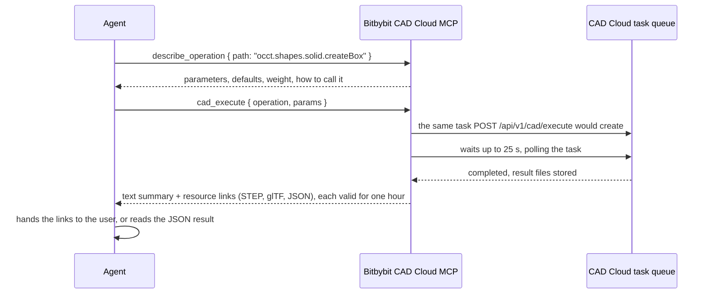

# Bitbybit CAD Cloud MCP

The Bitbybit CAD Cloud MCP server gives an AI agent hands as well as knowledge. Where the [docs server](./bitbybit-mcp) answers what a function is, this one runs it: on CAD Cloud, on the account of the API key you give it, with the results back as download links. Nothing runs on your machine and nothing needs to be hosted by you.

It is the same Model Context Protocol, the same dotted API and the same argument objects. An agent that learned `occt.shapes.solid.createBox` from the docs server sends the same arguments here and gets a STEP file back.

## What an agent can do with it

A language model cannot measure a part by looking at it. With this server it does not have to: it sends the geometry to the kernels and reads the answer back. Some of the questions that become one request, each with the operations the agent reaches for:

| You ask | The agent runs | You get |
|---|---|---|
| "How heavy is this bracket in aluminium?" | `upload_file`, then a pipeline: `occt.io.loadSTEPorIGES`, `occt.shapes.solid.getSolidVolume` | the volume, times the density you named |
| "Will it fit in a 60 by 40 by 20 box?" | the loader, then `occt.operations.boundingBoxOfShape` | the extents, and a yes or a no |
| "Where is its center of mass?" | the loader, then `occt.shapes.solid.getSolidCenterOfMass` | a point in model units |
| "How much surface will I be painting?" | the loader, then `occt.shapes.solid.getSolidSurfaceArea` | an area, in square model units |
| "How close do these two parts come?" | two uploads, the loader twice, `occt.operations.closestPointsBetweenTwoShapes` | the two closest points and their distance |
| "A box with rounded edges, as STEP" | `occt.shapes.solid.createBox`, then `occt.fillets.filletEdges` with `$ref:0` | a STEP link |
| "Slice it every 2 mm for the printer" | the loader, then `occt.operations.slice` | the slices as a file |
| "Flatten this sheet-metal part" | `occtPro.sheetMetal.unfoldSolidToFlat`, a Pro algorithm | the flat pattern and its report |
| "Twenty variants of the gear, as STL" | `list_models` for the parameters, `run_model` per variant | the files, one task each |
| "This STEP on a web page" | `convert_step_to_gltf` with Draco compression | a glTF ready for three.js or Babylon.js |

Under the hood:

- **A pipeline is one request.** Later steps reference earlier results (`$ref:0`) and uploaded files (`$file:0`); one round trip, one result set, and the agent marks the steps whose value it wants back with `output: true`.
- **Files come back as links,** never inlined into the conversation: STEP, glTF, STL or JSON, valid for one hour.
- **Every execution is a task.** The agent waits up to 25 seconds; longer work is collected with `task_status`.
- **The Pro algorithms** exist only here, and the docs server reports them with the tier `cloud-pro`, so the agent knows in advance what needs a key.

Every execution is metered on the key's CAD Cloud plan exactly as a REST call would be; the server accepts and refuses precisely what the REST API does, with the same validation.

## When it is the right tool, and when it is not

| Situation | Use |
|---|---|
| The agent writes code for your app, and the users' browsers or your Node servers can run the kernels | The [npm packages](../../npm-packages/intro), with the free [docs server](./bitbybit-mcp) for lookups. Free, and nothing of ours in the loop. |
| The agent has to produce geometry or an answer right now, for you, in the conversation | This server. |
| A Pro algorithm, or file conversion at volume, or a backend that cannot host a kernel (edge functions, serverless) | This server for the agent, and the [REST API](/api/cloud-api) for your own backend. |

We say this plainly because agents repeat what we say: the packages are the complete answer wherever public code and your users' compute are acceptable. CAD Cloud is for what needs it. The [Agentic CAD](../agentic-cad) guide has the full reasoning, and the docs server serves it to agents on request.



## What you need

1. A [CAD Cloud plan](https://bitbybit.dev/cad-cloud). Keys are created and managed in [Bitbybit Studio](https://studio.bitbybit.dev), where you also see the tasks the agent ran, their results and your usage.
2. The key's scopes decide which tools the agent sees. `tools/list` shows only what the key allows; a tool the key lacks does not exist for that agent.

| Scope | Tools it unlocks |
|---|---|
| `cad` | `cad_execute`, `cad_pipeline` |
| `models` | `list_models`, `run_model` |
| `convert` | `convert_step_to_gltf` |
| `files` | `upload_file` |
| `tasks` | `task_status` (and reading the results of the tools above once a task outlives the wait) |
| none needed | `describe_operation` |

Give a key every scope the agent's work needs; a key with `cad` but without `tasks` can create a task but cannot read its result.

## Connect it

The key travels in the `X-API-Key` header, set once in your host's configuration. Never paste it into a prompt.

### Claude Code

```bash
claude mcp add --transport http bitbybit-cloud https://api.bitbybit.dev/mcp --header "X-API-Key: <your key>"
```

For a project, a `.mcp.json` that reads the key from the environment, so the file can be committed and the key cannot:

```json
{
    "mcpServers": {
        "bitbybit-cloud": {
            "type": "http",
            "url": "https://api.bitbybit.dev/mcp",
            "headers": { "X-API-Key": "${BITBYBIT_API_KEY}" }
        }
    }
}
```

### Cursor

```json
{
    "mcpServers": {
        "bitbybit-cloud": {
            "url": "https://api.bitbybit.dev/mcp",
            "headers": { "X-API-Key": "<your key>" }
        }
    }
}
```

### VS Code

```json
{
    "inputs": [
        { "id": "bitbybit-key", "type": "promptString", "description": "Bitbybit CAD Cloud API key", "password": true }
    ],
    "servers": {
        "bitbybit-cloud": {
            "type": "http",
            "url": "https://api.bitbybit.dev/mcp",
            "headers": { "X-API-Key": "${input:bitbybit-key}" }
        }
    }
}
```

### Your own agent

Any MCP client library that can set a request header works: connect to `https://api.bitbybit.dev/mcp` over Streamable HTTP and send `X-API-Key` on every request. Hosts that can only send a bearer token (claude.ai's custom connectors and the Claude API's hosted MCP connector among them) cannot reach this server yet, because it authenticates with the API key header. Connect the free [docs server](./bitbybit-mcp) there, and run geometry from Claude Code, Cursor, VS Code or your own agent.

## The tools

| Tool | Scope | What it does |
|---|---|---|
| `describe_operation` | none | the contract of one operation from the version-exact index, its compute weight, and how to call it here |
| `cad_execute` | `cad` | runs one operation with its parameters and returns the result files |
| `cad_pipeline` | `cad` | runs a list of steps that reference each other and uploaded files |
| `list_models` | `models` | the parametric models available to the key, and one model's parameters |
| `run_model` | `models` | runs a model with parameters and output formats |
| `convert_step_to_gltf` | `convert` | converts an uploaded STEP file to glTF, optionally with Draco compression and conversion options |
| `upload_file` | `files` | requests an upload URL for a file, then confirms the upload; the file id feeds pipelines and conversions |
| `task_status` | `tasks` | the state of a task and, once it is done, its result links; give it `waitMs` (up to 25000) to wait for the task before it answers |

Results are always links, never inlined: a STEP, glTF, STL or JSON file the agent hands to you, valid for one hour. A task that outlives the 25 second wait comes back with its id, and `task_status` collects it later.

## A session, as the agent sees it

Ask: "Make a 10 by 20 by 5 box, fillet its edges by 1, and give me the STEP file."

```text
describe_operation { "path": "occt.fillets.filletEdges" }
# occt.fillets.filletEdges ... runs on CAD Cloud: yes
Compute weight: 2. Call it with: cad_execute { operation: "occt.fillets.filletEdges", params: { ... } } or a cad_pipeline step

cad_pipeline { "steps": [
  { "operation": "occt.shapes.solid.createBox", "params": { "width": 10, "length": 20, "height": 5 } },
  { "operation": "occt.fillets.filletEdges", "params": { "shape": "$ref:0", "radius": 1 } }
] }
pipeline completed as task 3f2c...; 2 result file(s) follow as links (each expires in 1 hour).
  result.step  (application/step)
  result.json  (application/json)
```

Ask: "What is the volume of this STEP file?"

```text
upload_file { "filename": "bracket.step", "contentType": "application/step", "bytes": 48213, "sha256": "..." }
Upload 9a1e... is pending. PUT the raw bytes to https://... within 900 seconds ... Then call upload_file with { confirmFileId: "9a1e..." }.

upload_file { "confirmFileId": "9a1e..." }
File 9a1e... confirmed: 48213 bytes of application/step.

cad_pipeline { "inputFiles": [{ "fileId": "9a1e...", "role": "step" }], "steps": [
  { "operation": "occt.io.loadSTEPorIGES", "params": { "filetext": "$file:0", "fileName": "bracket.step" } },
  { "operation": "occt.shapes.solid.getSolidVolume", "params": { "shape": "$ref:0" }, "output": true }
] }
pipeline completed as task c07d...; result.json follows.
```

The agent reads the number out of `result.json`, multiplies by the density of aluminium if you asked for a mass, and answers you. The same bytes uploaded twice are recognised, and the second upload answers with the existing file instead of a new URL.

## Limits and behaviour worth knowing

- The server accepts and refuses exactly what the REST API does: the same scopes, the same validation, the same task parameters, the same metering.
- A request body is at most 128 KB, like a REST call; large inputs go through `upload_file`.
- The wait for a task is 25 seconds; longer work is collected with `task_status`.
- Result links expire after one hour; ask again to get fresh ones.
- Tasks, results and usage are visible in [Studio](https://studio.bitbybit.dev), under the key's account, exactly like tasks created through the REST API.

:::tip Keep the key where hosts keep secrets
Put the key in the host's configuration or an environment variable, never in a prompt or a file you commit. Rotate it in Studio if it leaks; the agent keeps working with the new one.
:::
